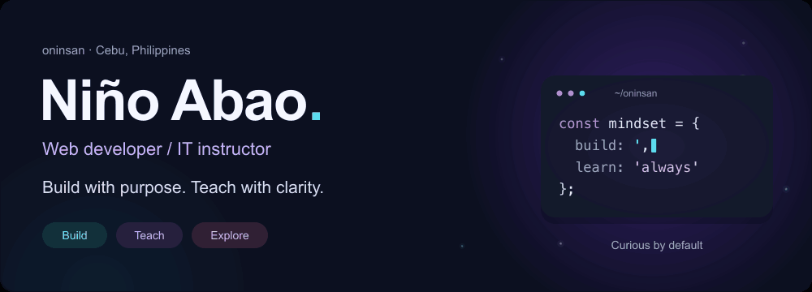
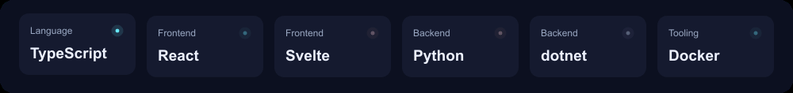
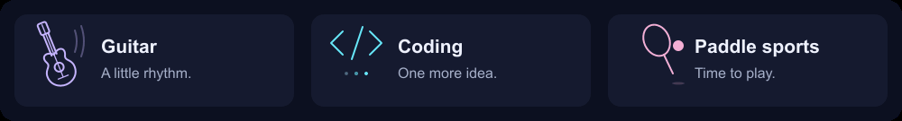

  <picture>
    <source media="(prefers-reduced-motion: reduce)" srcset="assets/banner-538f7c4799.svg">
    
  </picture>

  
  
  
  

## Code, craft, and curiosity

I'm **Niño Abao**, a **web developer and IT instructor** in **Bogo City, Cebu, Philippines**. I build practical web and mobile applications and help students turn programming concepts into real projects.

From responsive interfaces to APIs and databases, I enjoy building software that makes everyday work simpler. Clean code, reusable components, and clear documentation guide how I work.

### How I work

- **Web development:** responsive websites, interactive applications, and thoughtful user experiences.
- **Backend development:** REST APIs, application logic, database integration, and workflow automation.
- **Mobile development:** React Native and Expo apps with reusable components and persistent state.
- **Teaching:** practical lessons, live coding demos, and step-by-step guides for new developers.
- **Engineering habits:** clean code, reusable components, clear documentation, and version control.

## My toolkit

<picture>
  <source media="(prefers-reduced-motion: reduce)" srcset="assets/toolkit-27ef06dd69.svg">
  
</picture>

| Area | Languages, frameworks & tools |
| :--- | :--- |
| **Languages** | TypeScript · JavaScript · Python · C# · PHP · Java · HTML5 · CSS3 · SQL |
| **Frontend** | React · Svelte / SvelteKit · Vue.js · Tailwind CSS · Bootstrap · jQuery |
| **Mobile** | React Native · Expo · AsyncStorage |
| **Backend & APIs** | Node.js · Express.js · .NET · Django · Flask · REST APIs |
| **Databases** | PostgreSQL · MySQL · MongoDB |
| **Cloud & development** | AWS · Firebase · Docker · Git · GitHub · GitHub Actions |
| **Design & quality** | Figma · Adobe XD · Responsive design · ESLint · Vitest |

## Selected work

Practical tools, teaching resources, and reusable building blocks.

| Project | What it does | Built with |
| :--- | :--- | :--- |
| **[Student Name Parser](https://github.com/oninsan/LFM_Separator_frontend)** | Turns student names from registrar-generated PDFs into Excel-ready class records. [Backend →](https://github.com/oninsan/LFM_Separator) | Python · Flask · HTML · CSS |
| **[React Native Task List](https://github.com/oninsan/first-reactnative-app)** | A classroom demo covering components, state, hooks, and persistent task storage. | React Native · Expo · TypeScript |
| **[HTML & CSS Learning Path](https://github.com/oninsan/html-css-tutorial-students)** | Guided beginner lessons that build toward a complete personal webpage. | HTML · CSS · Teaching |
| **[Developer Portfolio](https://github.com/oninsan/DevPortfolio)** | My personal portfolio with project showcases, skills, and contact information. | SvelteKit · TypeScript · Tailwind CSS |
| **[ChairFlow Shared](https://github.com/oninsan/chairflow-shared)** | A shared package for types, theme tokens, and formatters, with build and quality checks. | TypeScript · ESLint · Vitest |

<strong>A few more projects from my portfolio</strong>

- **[Resume Maker](https://gitlab.com/oninsama/resume-maker/-/tree/master):** a tool for creating personalized CVs with flexible sections. Built with HTML, CSS, PHP, and SQL.
- **[Online Archive of Learning Materials](https://gitlab.com/oninsama/onlinarchiveforlearningmaterials):** a learning resource platform for teachers and students. Built with MongoDB, Express, React, and Node.js.
- **[Bluewave](https://github.com/oninsan/3rd-ecom):** an early Django project for discovering tourist spots in Bogo City.

## Beyond the keyboard

<picture>
  <source media="(prefers-reduced-motion: reduce)" srcset="assets/hobbies-a1f40863d0.svg">
  
</picture>

- **Playing guitar:** time for music between projects.
- **Coding:** a profession, a hobby, and a reason to keep experimenting.
- **Playing paddle sports:** time to get moving and enjoy the game.

## Let's connect

Have a project, a technical idea, or something worth building together? I'd love to hear about it.

**[Email](mailto:kokoybaldofordawin@gmail.com)** · **[LinkedIn](https://www.linkedin.com/in/ni%C3%B1o-abao-415124185/)** · **[GitHub](https://github.com/oninsan)** · **[Portfolio source](https://github.com/oninsan/DevPortfolio)**

<picture>
  <source media="(prefers-reduced-motion: reduce)" srcset="assets/footer-ff413b9c7e.svg">
  
</picture>
