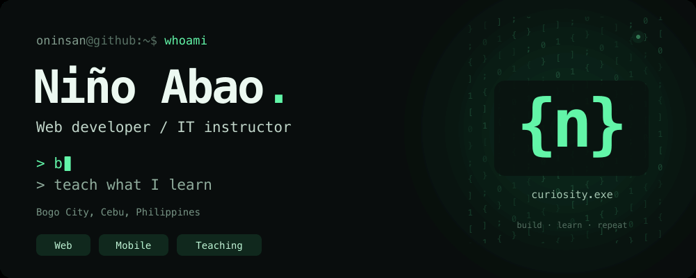
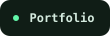
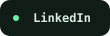
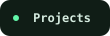
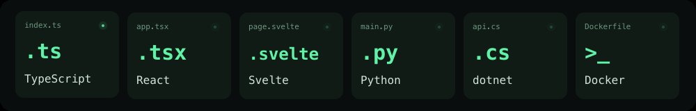
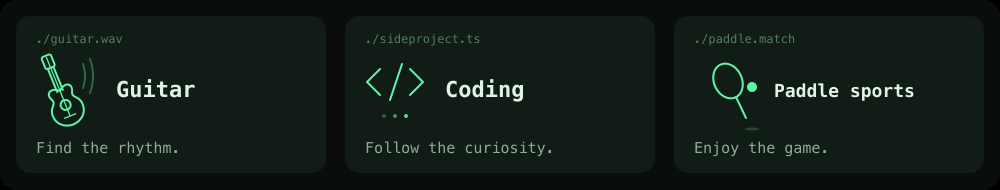

  <picture>
    <source media="(prefers-reduced-motion: reduce)" srcset="assets/banner-9d90d0cb06.svg">
    
  </picture>

  
  
  
  

### `~/about`

I'm **Niño Abao**, a **web developer and IT instructor** in **Bogo City, Cebu, Philippines**. I build practical web and mobile applications and help students turn programming concepts into real projects.

- **Build:** responsive interfaces, REST APIs, database integrations, and tools that simplify everyday work.
- **Teach:** practical lessons, live coding demos, and guides that make development easier to understand.
- **Keep improving:** reusable components, clean code, clear documentation, and experiments that turn into useful ideas.

### `~/stack`

<picture>
  <source media="(prefers-reduced-motion: reduce)" srcset="assets/toolkit-af3ca29034.svg">
  
</picture>

| Layer | Languages, frameworks & tools |
| :--- | :--- |
| **Languages** | TypeScript · JavaScript · Python · C# · PHP · Java · HTML5 · CSS3 · SQL |
| **Frontend** | React · Svelte / SvelteKit · Vue.js · Tailwind CSS · Bootstrap · jQuery |
| **Mobile** | React Native · Expo · AsyncStorage |
| **Backend** | Node.js · Express.js · .NET · Django · Flask · REST APIs |
| **Databases** | PostgreSQL · MySQL · MongoDB |
| **Cloud & development** | AWS · Firebase · Docker · Git · GitHub · GitHub Actions |
| **Design & quality** | Figma · Adobe XD · Responsive design · ESLint · Vitest |

### `~/projects`

A few things I've built for real workflows, classrooms, and other developers.

<table>
  <tr>
    <td width="50%" valign="top">
      
<code>~/name-parser</code>

      <h4><a href="https://github.com/oninsan/LFM_Separator_frontend">Student Name Parser ↗</a></h4>
      
Extracts student names from registrar PDFs and prepares Excel class records.

      
<code>Python</code> <code>Flask</code> <code>HTML / CSS</code>

      
<a href="https://github.com/oninsan/LFM_Separator">Backend source →</a>

    </td>
    <td width="50%" valign="top">
      
<code>~/task-list</code>

      <h4><a href="https://github.com/oninsan/first-reactnative-app">React Native Task List ↗</a></h4>
      
A teaching app for components, hooks, state, and persistent task storage.

      
<code>React Native</code> <code>Expo</code> <code>TypeScript</code>

    </td>
  </tr>
  <tr>
    <td width="50%" valign="top">
      
<code>~/html-css</code>

      <h4><a href="https://github.com/oninsan/html-css-tutorial-students">HTML & CSS Learning Path ↗</a></h4>
      
A guided path from a first HTML file to a complete personal webpage.

      
<code>HTML</code> <code>CSS</code> <code>Teaching</code>

    </td>
    <td width="50%" valign="top">
      
<code>~/portfolio</code>

      <h4><a href="https://github.com/oninsan/DevPortfolio">Developer Portfolio ↗</a></h4>
      
My projects, skills, and contact information in a SvelteKit portfolio.

      
<code>SvelteKit</code> <code>TypeScript</code> <code>Tailwind</code>

    </td>
  </tr>
  <tr>
    <td width="50%" valign="top">
      
<code>~/shared</code>

      <h4><a href="https://github.com/oninsan/chairflow-shared">ChairFlow Shared ↗</a></h4>
      
Reusable types, theme tokens, and formatters, with builds and quality checks.

      
<code>TypeScript</code> <code>ESLint</code> <code>Vitest</code>

    </td>
    <td width="50%" valign="top">
      
<code>~/archive</code>

      <h4><a href="https://github.com/oninsan?tab=repositories">More experiments ↗</a></h4>
      
Resume tools, learning archives, early Django projects, and more things I've explored.

      
<code>PHP</code> <code>Django</code> <code>React</code>

    </td>
  </tr>
</table>

<strong>Open the project archive</strong>

- **[Resume Maker](https://gitlab.com/oninsama/resume-maker/-/tree/master):** personalized CVs with flexible sections, built with HTML, CSS, PHP, and SQL.
- **[Online Archive of Learning Materials](https://gitlab.com/oninsama/onlinarchiveforlearningmaterials):** a resource platform for teachers and students, built with MongoDB, Express, React, and Node.js.
- **[Bluewave](https://github.com/oninsan/3rd-ecom):** an early Django project for discovering tourist spots in Bogo City.

### `~/offline`

<picture>
  <source media="(prefers-reduced-motion: reduce)" srcset="assets/hobbies-75d9256303.svg">
  
</picture>

Away from project work, I enjoy **playing guitar**, **coding for fun**, and **playing paddle sports**.

### `~/connect`

Have an idea, a project, or something interesting to build together? Let's talk.

**[Email](mailto:kokoybaldofordawin@gmail.com)** · **[LinkedIn](https://www.linkedin.com/in/ni%C3%B1o-abao-415124185/)** · **[GitHub](https://github.com/oninsan)** · **[Portfolio source](https://github.com/oninsan/DevPortfolio)**

<picture>
  <source media="(prefers-reduced-motion: reduce)" srcset="assets/footer-7fb065fdde.svg">
  
</picture>
